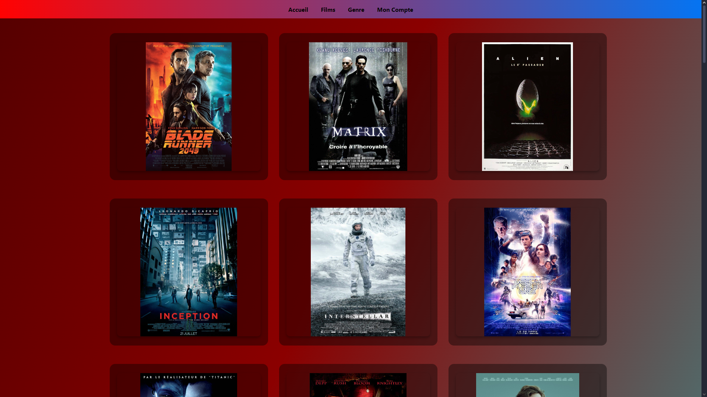
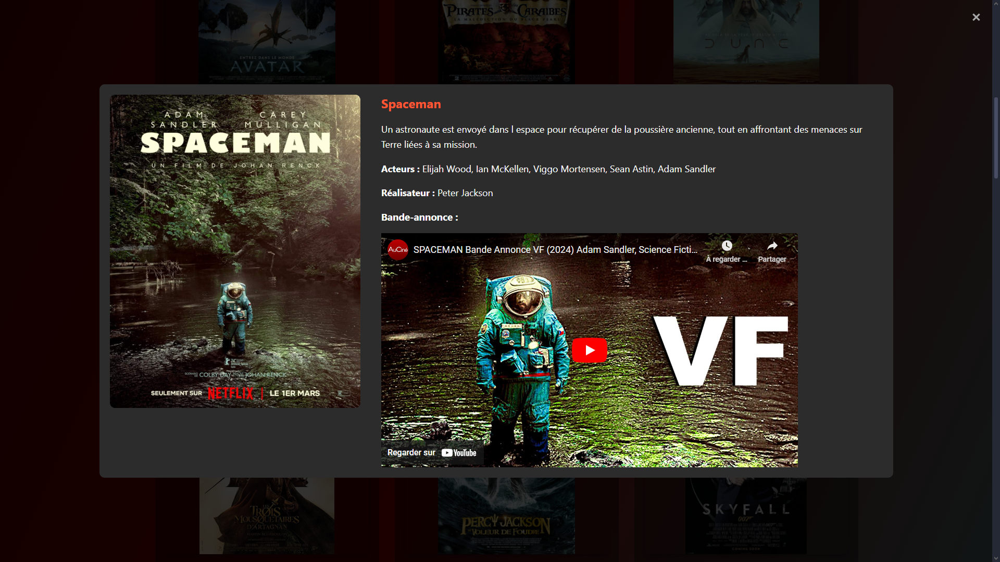

# MovieAddict

Ce projet consiste à créer une plateforme de streaming (comme netflix par exemple).
Il nous permet d'appréhender les notions de backend et frontend, mais également d'en apprendre plus en HTML et CSS.

## Foncionnalités
 - Regarder des films (ici des bandes-annonces feront office de films)
 - Créer un compte / Se connecter
 - Ajouter des commentaires
 - Noter un film

## Installation

1. Clonez le dépôt :
```bash
    git clone https://github.com/Plouis-Dnx/SchoolProject.git
```

2. Ouvrez l'invite de commande et déplacez-vous dans le dossier clôné :
```bash
    cd "C:\...\SchoolProject"
```

3. Lancez le serveur
```bash
    node server.js
```

4. Suivre le lien indiqué : http://localhost:3000

### Prérequis
- Node.js >= v14.x
- NPM

## Utilisation

Une fois sur le site, vous pouvez : 
1. Créer un compte ou vous connecter si vous en posséder déjà un.
2. Consulter la liste des films
3. Ajouter des commentaires et des notes sur les films

## Image

Voici comment se présente la consultation d'un film :




